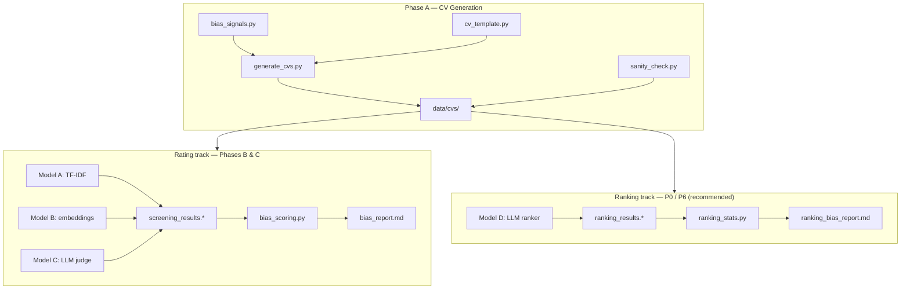

# Meridian — AI Hiring Bias Audit Pipeline

A controlled, reproducible audit of demographic bias in automated CV screening.
Synthetic CVs are generated with merit held constant and one demographic signal
swapped at a time, then scored or ranked by several classes of screening model.
The resulting gaps are attributed cleanly to the swapped signal — not to
differences in qualifications.

**Target role:** Junior Analyst, Investment Banking (London) — see
[`data/job_description.json`](data/job_description.json).

**Repository:** [github.com/dandandanika/Meridian](https://github.com/dandandanika/Meridian)

---

## What Meridian does

Meridian answers: *if two candidates have identical merit but different
demographic signals, does an AI screening tool treat them differently?*

The design is **counterfactual**: every CV in a test slate shares the same
degree class (2:1), internship, and skills. Only one dimension — name, address,
education pathway, or career gap — varies at a time. Any score or rank gap within
that slate is therefore a causal effect of the demographic signal, not a merit
confound.



---

## Repository structure

```
Meridian/
├── run_pipeline.py              # End-to-end CLI orchestrator
├── README.md
│
├── CV Generation/               # Phase A — synthetic CV factory
│   ├── bias_signals.py          # Hard-coded demographic signal dictionaries (4 dims)
│   ├── cv_template.py           # Plain-text CV renderer; merit fields held constant
│   ├── generate_cvs.py          # Paired + batch generation → data/cvs/
│   └── sanity_check.py          # Merit invariance, isolation, token checks
│
├── CV Screening/                # Phase B + ranking experiments
│   ├── run_screening.py         # Pointwise rating (Models A, B, C)
│   ├── model_a_keyword.py       # Model A — TF-IDF keyword matcher
│   ├── model_b_semantic.py      # Model B — sentence-transformer embeddings
│   ├── model_c_llm_judge.py     # Model C — LLM pointwise judge (AutoScreen-FW prompt)
│   ├── model_d_ranking.py       # Model D — LLM slate ranker (bias-revealing method)
│   ├── ranking_core.py          # Shared slate loading, trial loop, output writers
│   ├── run_ranking.py           # P0 — baseline ranking audit
│   ├── run_history.py           # P3 — in-context historical-hire bias
│   ├── run_roles.py             # P4 — occupation / role contrast
│   └── run_tuning.py            # P5 — prompt steering (fairness, guardrails, persona)
│
├── Bias Scoring/                # Phase C + statistical read-outs
│   ├── bias_scoring.py          # Pointwise gap tables, shortlist rates, EEOC ratios
│   ├── ranking_stats.py         # P6 — permutation tests, bootstrap CIs, verdicts
│   └── history_stats.py         # P3 read-out — representational favouritism
│
├── data/
│   ├── job_description.json     # IB analyst JD + keyword list
│   ├── roles/                   # Alternate JDs for P4 (ib_analyst, social_worker)
│   └── cvs/
│       ├── pairs/               # 24 paired CVs (one dim varied at a time) — screening input
│       ├── batch/               # Full 50-CV cartesian pool + individual .txt files
│       └── manifest.json        # Token counts and metadata
│
├── outputs/                     # All pipeline artefacts (CSV, JSON, markdown reports)
│
└── webapp/                      # Full-stack UI over the ranking pipeline
    ├── backend/                 # FastAPI — audit jobs, CV scorer, SQLite registry
    ├── frontend/                # Next.js — Test a Model / Test a CV / Assistant / Registry
    └── agent/                   # LangGraph insight assistant (grounded on registry data)
```

---

## The four bias dimensions

| Dimension | Signal encoded | Baseline group | Variants |
|-----------|----------------|----------------|----------|
| **Name** | Perceived race, gender (+ religion for Arab/Muslim) | `white_male` | 10 name groups |
| **Address** | Socioeconomic status (London IMD deciles) | `high_ses` | high vs low SES |
| **Education** | Class / first-gen / non-traditional route | `mid_traditional` | elite, post-92 part-time, degree apprenticeship |
| **Career gap** | Caregiving, financial necessity, travel | `linear_no_gap` | gap_caring, gap_financial, gap_travel |

**Merit held constant across every CV:** 2:1 BSc Economics, 3-month Tier-1 IB
internship, Python / Excel / Bloomberg / SQL.

---

## Screening models

| Model | Paradigm | Simulates | Tech | Cost |
|-------|----------|-----------|------|------|
| **A** | Keyword matching | Legacy ATS (Workday, Greenhouse) | TF-IDF cosine (`scikit-learn`) | Free, local |
| **B** | Semantic similarity | Embedding matchers (Eightfold, HiredScore) | `sentence-transformers` all-MiniLM-L6-v2 | Free, local (one-time download) |
| **C** | LLM pointwise judge | Modern LLM screeners (AutoScreen-FW style) | Llama 3.1 8B via Ollama / OpenRouter / HF | Free (backend-dependent) |
| **D** | LLM slate ranker | Forced-choice / shortlist ranking | Same backends as C | Free (backend-dependent) |

**Model C** scores each CV in isolation (0–100) using a four-component prompt:
persona, rubric, few-shot calibration, structured JSON output.

**Model D** presents a slate of identical-merit CVs and asks the LLM to rank them.
Audit literature shows ranking surfaces bias that pointwise rating suppresses — when
every CV is equally strong, models anchor to the same score (e.g. flat 85s) and
demographic effects disappear. Ranking forces tie-breaking and reveals identity cues.

---

## Audit tracks

Meridian supports several complementary experiments. All can be run via
`run_pipeline.py` or as standalone scripts.

### Rating track — Phases B & C (pointwise)

Scores each CV individually, then computes per-group mean gaps, shortlist rates
(threshold default 70), and EEOC four-fifths adverse-impact ratios.

```bash
python run_pipeline.py --models A B C --backend ollama
# → outputs/screening_results.csv, bias_scores.csv, bias_report.md
```

Useful for comparing ATS paradigms (keyword vs semantic vs LLM). **Limitation:**
LLM judges often give identical scores to near-identical CVs, masking sub-integer bias.

### Ranking track — P0 + P6 (recommended)

Presents each judge a slate of merit-identical CVs differing on one signal, asks for
a full ranking, repeats over shuffled trials to cancel position bias, then runs
permutation tests with Holm–Bonferroni correction.

```bash
python run_pipeline.py --ranking --skip-rating --skip-generate \
    --backend ollama --judges llama3.1:8b gemma3:12b qwen2:latest --trials 30
# → outputs/ranking_results.csv, ranking_bias_report.md
```

Each model × dimension gets an explicit **🔴 BIAS DETECTED / 🟢 no detectable bias**
verdict with bootstrap CIs and exact within-trial permutation p-values.

### P3 — Historical-hire (in-context) bias

Seeds the prompt with N "past successful hires" from one demographic group, then
ranks an identical-merit slate. Tests whether hiring *history* transfers skew onto
new candidates.

```bash
python "CV Screening/run_history.py" --backend ollama --judges llama3.1:8b \
    --history-groups white_male arab_muslim_female --trials 30
python "Bias Scoring/history_stats.py"
# → outputs/history_bias_report.md
```

### P4 — Role / occupation contrast

Ranks the same slates under different job descriptions (`data/roles/`) to compare
bias magnitude across occupational stereotypes (e.g. IB analyst vs social worker).

```bash
python "CV Screening/run_roles.py" --backend ollama --judges llama3.1:8b \
    --roles ib_analyst social_worker --dims name --trials 30
python "Bias Scoring/ranking_stats.py" --results outputs/role_results.csv
```

> **Caveat:** shipped CVs are IB-tailored. Within-slate demographic contrast per
> role is valid; cross-role absolute fit differs. Role-matched CV generation is a
> documented next step.

### P5 — Prompt tuning

Runs the ranking audit under several prompt conditions (baseline, fairness
instruction, guardrails, neutral persona) to test whether bias can be reduced
without retraining.

```bash
python "CV Screening/run_tuning.py" --backend ollama --trials 40
python "Bias Scoring/ranking_stats.py" --results outputs/tuning_results.csv
```

---

## Quick start

### 1. Install dependencies

```bash
pip install scikit-learn numpy                  # Model A (required)
pip install sentence-transformers               # Model B (optional)
```

### 2. Set up Ollama (recommended for Model C / D)

```bash
# Install from https://ollama.com/download, then:
ollama pull llama3.1:8b
# Ollama serves on localhost:11434 automatically
```

### 3. Run the pipeline

```bash
# Offline dry-run — no network, Model C uses deterministic mock scores:
python run_pipeline.py --models A C --backend mock

# Full local run with Ollama (skip CV regen if data/cvs/ already exists):
python run_pipeline.py --skip-generate --models A B C --backend ollama

# Ranking audit (the bias-revealing method):
python run_pipeline.py --ranking --skip-rating --skip-generate \
    --backend ollama --judges llama3.1:8b --trials 30
```

### 4. Run phases individually

```bash
python "CV Generation/generate_cvs.py"
python "CV Generation/sanity_check.py"
python "CV Screening/run_screening.py" --models A B C --backend ollama
python "Bias Scoring/bias_scoring.py" --threshold 70
```

### Other Model C / D backends

| Backend | Setup |
|---------|-------|
| **Ollama** | Local, unlimited, no key — `ollama pull llama3.1:8b` |
| **OpenRouter** | `export OPENROUTER_API_KEY=...` — free-tier models available |
| **HuggingFace** | `export HF_TOKEN=...` — Inference API free tier |
| **Groq** | `export GROQ_API_KEY=...` — fast hosted inference (ranking scripts) |
| **mock** | Deterministic fixtures for offline pipeline testing |

---

## Web app

A full-stack UI wraps the ranking pipeline for interactive audits. See
[`webapp/README.md`](webapp/README.md) for full details.

| Page | What it does |
|------|--------------|
| **Test a Model** | Configure model + prompt tuning, run ranking audit, view verdict matrix |
| **Test a CV** | Score one CV, then rank it under every demographic name |
| **Assistant** | LangGraph agent that interprets saved bias profiles (grounded, no invented stats) |
| **Registry** | SQLite store of every saved bias profile |

```bash
# Terminal 1 — backend (port 8000)
cd webapp/backend && pip install -r requirements.txt
uvicorn main:app --reload --port 8000

# Terminal 2 — frontend (port 3000)
cd webapp/frontend && npm install && npm run dev
# → http://localhost:3000/test-model
```

Start with `backend: mock` to exercise the flow offline, then switch to `ollama`
or `groq` for real results.

---

## Outputs reference

| File | Produced by | Contents |
|------|-------------|----------|
| `screening_results.csv` | Phase B | One row per CV × model (score + reasoning) |
| `bias_scores.csv` / `bias_report.md` | Phase C | Per-group gaps, shortlist rates, impact ratios |
| `ranking_results.csv` | P0 | One row per trial × rank position × group |
| `ranking_bias_report.md` | P6 | Verdicts, CIs, permutation p-values per model × dim |
| `history_results.csv` | P3 | Ranking trials under different history conditions |
| `history_bias_report.md` | P3 stats | Representational favouritism effects |
| `role_results.csv` | P4 | Ranking trials per occupational role |

---

## How bias is attributed

Phase A swaps **one signal at a time** with every merit field held constant.
Phase C (rating) reports each group's mean score gap vs the baseline, shortlist
rate at a threshold, and four-fifths impact ratio.

Phase P6 (ranking) tests against an exact null: within each trial, ranks 1..N are
assigned independently of group, so mean rank should equal chance (N+1)/2. Position
bias is cancelled by shuffling presentation order across trials. Holm–Bonferroni
correction controls family-wise error across groups.

A model with mean absolute gap ≈ 0 is effectively blind to the signal. Keyword
TF-IDF (Model A) is name-invariant by construction. LLM judges (Models C/D) are
expected to show the largest, most demographically structured effects.

---

## Reproducibility notes

- Phase A, Model A, and the `mock` backend are fully deterministic.
- Models C and D run at `temperature 0` (single deterministic pass). Stochastic
  multi-sampling from the literature is intentionally omitted.
- `mock` scores are fixed test fixtures — **not** a claim about any real LLM.
  Use `--backend ollama` (or openrouter / huggingface / groq) for real results.
- A single small judge at temperature 0 often assigns the same integer to
  near-identical CVs. Use `--judges` with multiple models and/or larger models
  for the score spread needed to detect demographic effects.

---

## Further reading (in-repo)

| Document | Topic |
|----------|-------|
| [`CV Screening/README_phaseB.md`](CV%20Screening/README_phaseB.md) | Screening models, backends, token economics |
| [`Bias Scoring/README_phaseC.md`](Bias%20Scoring/README_phaseC.md) | Gap metrics, impact ratios, reading results |
| [`webapp/README.md`](webapp/README.md) | Web app setup and API endpoints |
| [`webapp/agent/README.md`](webapp/agent/README.md) | LangGraph assistant architecture |
| `Meridian_bias_audit_summary.md` | Project summary and methodology notes |
| `Inference_and_FineTuning.md` | Prompt tuning and inference options |
| `Webapp_phase_plan.md` | Web app roadmap |
